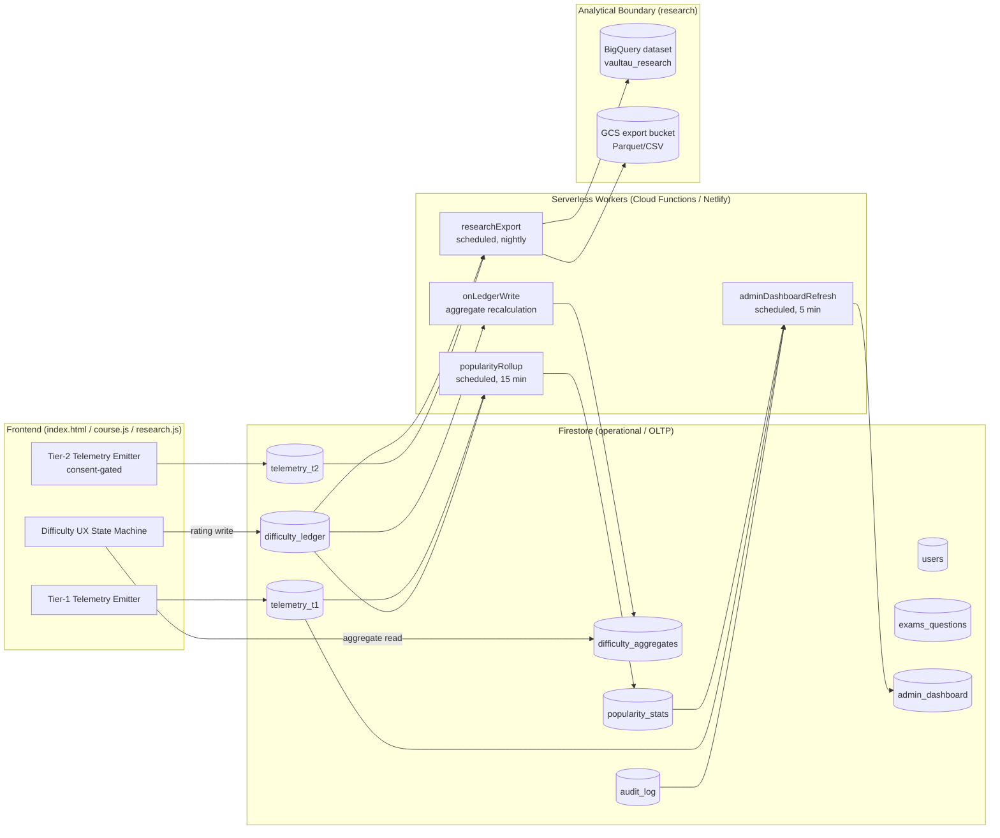
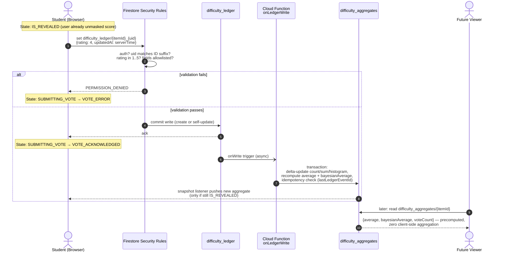
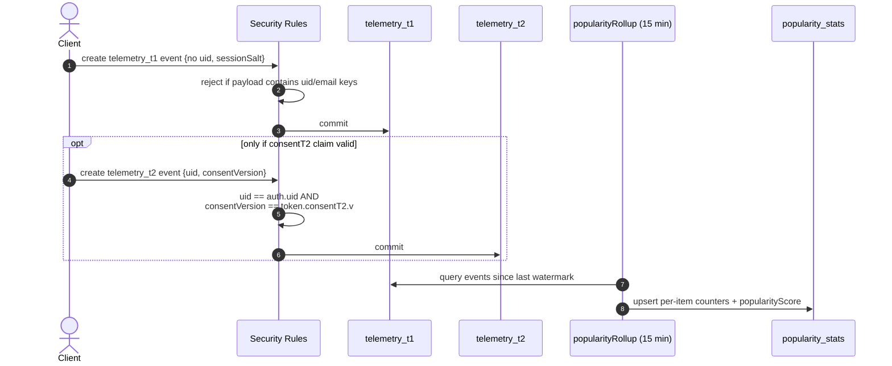
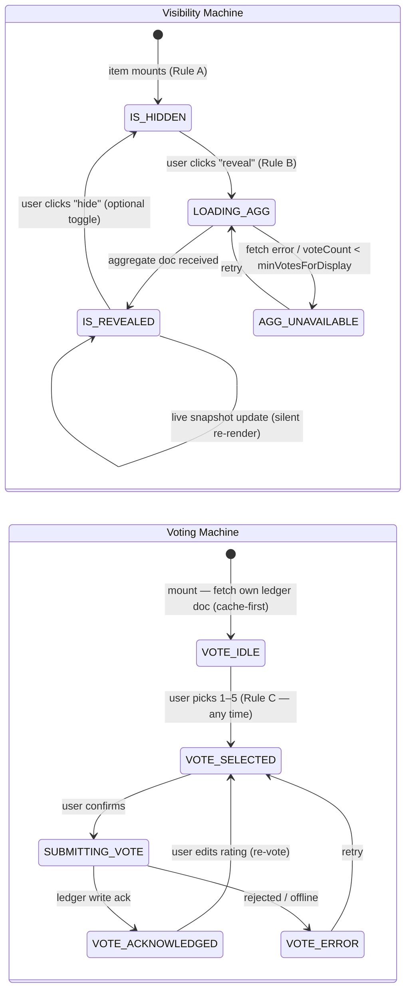
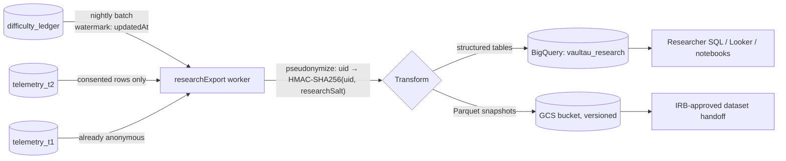

# VaultAU — Telemetry, Crowdsourced Difficulty & Admin/Research Architecture

> **Status:** Design — ready for implementation handoff
> **Audience:** Implementing developer / code-generation model
> **Scope:** Architecture only. No application code. All schemas target **Cloud Firestore** (existing stack: Firebase Auth + Firestore + Netlify/Cloud Functions).
> **Existing building blocks reused:** `users.analyticsConsent`, `analytics_events`, `questionVotes` (superseded), `research_stats`, `functions/research-stats-refresh`.

---

## 1. System Overview



**Core invariants (non-negotiable):**

1. **Clients never compute aggregates.** The only difficulty number a client may render comes from `difficulty_aggregates/{itemId}`.
2. **Hard tier boundary.** Tier-1 and Tier-2 telemetry live in *separate collections* with *separate rule blocks*; Tier-2 writes are rejected at the security-rules layer unless a live consent record exists.
3. **One vote per user per item**, enforced structurally by deterministic document IDs — not by client logic.
4. **OLTP/OLAP separation.** Researchers and heavy analytical queries never touch live Firestore; they use the nightly-exported BigQuery dataset.

---

## 2. Database Schema Design (Firestore)

### 2.1 Naming & normalization strategy

- **Denormalize for reads, normalize for writes.** Raw facts (`difficulty_ledger`, `telemetry_*`) are append-only and normalized (one event = one doc). Read-optimized projections (`difficulty_aggregates`, `popularity_stats`, `admin_dashboard`) are denormalized and written **only by server workers** (Admin SDK bypasses rules).
- **Deterministic IDs** wherever uniqueness is an invariant: `difficulty_ledger` doc ID = `{itemId}_{uid}`.
- `itemId` is a namespaced key covering both exams and questions: `exam:{examId}` or `q:{examId}:{questionId}`. One aggregates collection serves both entity types.

### 2.2 `users/{uid}` — tier split

The tier split is **field-group based within the user doc plus physically separate telemetry collections**. The user doc holds identity + consent state only; behavioral data never lives on the user doc.

```
users/{uid}
├─ uid: string                     // == doc ID
├─ email: string
├─ role: 'student' | 'instructor' | 'admin'   // existing; self-write blocked by rules
├─ displayName: string
├─ createdAt: timestamp
│
├─ analyticsConsent: map | null    // Tier-2 gate (existing field, self-writable only)
│   ├─ granted: boolean
│   ├─ version: string             // consent-terms version, e.g. "2026-01"
│   ├─ grantedAt: timestamp
│   └─ revokedAt: timestamp | null
│
└─ consentAuditLog: array<map>     // existing; append-only history of grant/revoke
    └─ { action: 'grant'|'revoke', version, at: timestamp }
```

**Consent token (server-visible mirror).** To let security rules validate Tier-2 writes *without* trusting client-sent fields, a Cloud Function (`onUserConsentChange`, Firestore trigger on `users/{uid}`) mirrors the consent state into a **custom auth claim**: `consentT2: { v: "2026-01", exp: <epoch> }`. Rules check `request.auth.token.consentT2.v` — no extra `get()` per write, and revocation propagates on next token refresh (force-refresh client-side after grant/revoke). Fallback rule path also checks the user doc via `get()` for the window before token refresh.

**Indexing:** single-field default indexes suffice; add composite `(role ASC, createdAt DESC)` for the admin user list.

### 2.3 Telemetry — Tier 1 vs Tier 2 (hard boundary)

Two physically separate collections. Never joinable by design: Tier 1 carries **no uid**.

```
telemetry_t1/{eventId=auto}            // UNIVERSAL, ANONYMOUS
├─ event: string                       // 'page_view' | 'exam_open' | 'question_view'
│                                      // | 'search' | 'bookmark_add' | 'attempt_start' ...
├─ itemId: string | null               // 'exam:...' / 'q:...' — content ref, not user ref
├─ courseId: string | null
├─ sessionSalt: string                 // random per-session token, rotated on login,
│                                      // NEVER derived from uid (prevents re-identification)
├─ timestamp: timestamp                // must == request.time
├─ payload: map (≤10 keys)             // coarse dimensions only: viewport bucket,
│                                      // locale, referrer type. NO free text, NO ids.
└─ expiresAt: timestamp                // Firestore TTL policy → auto-purge at 90 days

telemetry_t2/{eventId=auto}            // OPT-IN, IDENTIFIED
├─ uid: string                         // must == request.auth.uid
├─ consentVersion: string              // must == request.auth.token.consentT2.v
├─ event: string                       // fine-grained: 'question_dwell', 'answer_change',
│                                      // 'reveal_difficulty', 'nav_sequence', ...
├─ itemId, courseId: string | null
├─ timestamp: timestamp                // == request.time
├─ payload: map (≤20 keys)             // rich behavioral detail allowed here
└─ expiresAt: timestamp                // TTL 365 days (IRB retention window)
```

**Boundary enforcement (3 layers):**
1. **Rules layer** — `telemetry_t1.create` rejects any doc containing a `uid`/`email` key; `telemetry_t2.create` requires valid consent claim (see §4).
2. **Schema layer** — separate collections; no query can join them (no shared key).
3. **Purge layer** — on consent revoke, a Cloud Function (`onConsentRevoke`) hard-deletes all `telemetry_t2` docs for that uid and tombstones the export queue (right-to-erasure).

**Indexing:** composite `(event ASC, timestamp DESC)` on both; `(uid ASC, timestamp DESC)` on `telemetry_t2` (required for purge + per-user research pulls). TTL policy on `expiresAt` for both.

### 2.4 `exams_questions` — content model

Existing `exams/{examId}` collection is retained; questions live in a subcollection (or embedded array for small exams — implementer: keep whichever the current parse pipeline produces, the difficulty system only needs stable IDs).

```
exams/{examId}
├─ courseId: string
├─ title, year, semester, ...          // existing fields
├─ hiddenFromStudents: boolean         // existing
├─ assignedLecturers: array<uid>       // existing
└─ questions/{questionId}              // subcollection
    ├─ order: number
    ├─ type: string
    ├─ body/media refs ...             // existing content fields
    └─ (NO difficulty fields here)     // difficulty deliberately NOT stored on content
```

> **Why no difficulty on the content doc:** content docs are admin/lecturer-writable; aggregates must be server-only. Mixing them would force field-level rule gymnastics. Aggregates live in their own collection keyed by `itemId`.

### 2.5 `difficulty_ledger/{itemId}_{uid}` — the Research Ledger

Raw, individual ratings. **Append/overwrite-own-only**; the deterministic ID *is* the one-vote-per-item guarantee.

```
difficulty_ledger/{itemId}_{uid}
├─ itemId: string                      // 'exam:{examId}' | 'q:{examId}:{questionId}'
├─ itemType: 'exam' | 'question'
├─ examId: string
├─ questionId: string | null
├─ courseId: string                    // denormalized for research slicing
├─ uid: string                         // == request.auth.uid; pseudonymized on export
├─ rating: number                      // int 1–5, validated in rules
├─ prevRating: number | null           // set on re-vote; lets the aggregator apply a delta
├─ createdAt: timestamp                // first vote
├─ updatedAt: timestamp                // == request.time on every write
└─ context: map                        // { semester, attemptState: 'before'|'after_attempt',
                                       //   source: 'exam_page'|'question_page' } ≤5 keys
```

**Re-vote semantics:** users may change their rating; the doc is overwritten in place (`updatedAt` bumps, `prevRating` records old value). The ledger therefore holds *current* rating per user; full rating *history* is preserved in the OLAP export (nightly snapshots capture changes; if per-change history is IRB-required, the aggregator worker also appends to `difficulty_ledger_history` — server-written, optional Phase 2).

**Indexing:**
- Composite `(itemId ASC, updatedAt DESC)` — aggregation & research pulls per item.
- Composite `(courseId ASC, updatedAt DESC)` — research slicing per course.
- Composite `(uid ASC, updatedAt DESC)` — erasure/purge and "my ratings" view.

### 2.6 `difficulty_aggregates/{itemId}` — the Dynamic Aggregate

Server-written only. This is the **only** difficulty document clients read. Supersedes the legacy `questionVotes` numeric fields (keep `questionVotes` read path during migration, then freeze).

```
difficulty_aggregates/{itemId}
├─ itemId, itemType, examId, questionId, courseId   // mirror of ledger keys
├─ voteCount: number
├─ ratingSum: number                   // internal; enables O(1) delta updates
├─ average: number                     // ratingSum / voteCount, rounded to 2dp
├─ histogram: map                      // { "1": n, "2": n, "3": n, "4": n, "5": n }
├─ bayesianAverage: number             // (C*m + ratingSum) / (C + voteCount)
│                                      //  m = global mean, C = 10 (confidence prior);
│                                      //  UI displays THIS to damp low-N noise
├─ minVotesForDisplay: number          // 3 (client masks "not enough data" below this)
└─ updatedAt: timestamp
```

**Indexing:** composite `(courseId ASC, average DESC)` and `(examId ASC, average DESC)` — admin "most difficult" leaderboards.

### 2.7 `popularity_stats/{itemId}` — engagement projection (server-written)

Rolled up from `telemetry_t1` (anonymous — popularity requires no identity) on a 15-minute schedule.

```
popularity_stats/{itemId}
├─ itemId, itemType, examId, courseId
├─ views7d / views30d / viewsTotal: number
├─ uniqueSessions7d: number            // approx-distinct over sessionSalt
├─ bookmarks: number
├─ attempts7d / attemptsTotal: number
├─ avgTimeSpentSec: number             // from t1 dwell events (coarse buckets)
├─ difficultyVotes7d: number           // ledger write velocity (engagement signal)
├─ popularityScore: number             // weighted: 1*view + 3*bookmark + 5*attempt,
│                                      // 7-day half-life exponential decay
└─ updatedAt: timestamp
```

**Indexing:** `(courseId ASC, popularityScore DESC)` — admin hot-list per course.

### 2.8 Admin & audit collections (server-written)

```
admin_dashboard/{docId}                // docId: 'overview' | 'security' | 'course:{id}'
├─ generatedAt: timestamp
├─ window: '5m' | '1h' | '24h'
└─ metrics: map                        // pre-shaped for direct render:
                                       // activeSessions, writesPerMin, errorRate,
                                       // topCourses[], topExams[], anomalies[],
                                       // consentGrantRate, t2OptInCount

audit_log/{eventId=auto}               // append-only, server/rules-written
├─ actorUid: string | 'system'
├─ action: string                      // 'role_change', 'exam_delete', 'consent_grant',
│                                      // 'export_run', 'rule_denied_t2_write', ...
├─ target: string                      // doc path or itemId
├─ detail: map (≤10 keys)
├─ timestamp: timestamp
└─ expiresAt: timestamp                // TTL 400 days
```

---

## 3. Data Flow & Aggregation Pipeline

### 3.1 Step-by-step: rating submission → aggregate update

1. **Client submits** a rating: `set()` on `difficulty_ledger/{itemId}_{uid}` (merge). If the doc exists, client includes `prevRating` read from its own cached copy; rules verify `prevRating == resource.data.rating` on update (tamper check).
2. **Security rules validate** (auth, ownership, `rating ∈ [1..5]`, server timestamp, field allowlist). Deterministic ID makes a second "create" for the same item impossible — it becomes an update of the user's own doc.
3. **Firestore trigger fires**: Cloud Function `onLedgerWrite` (`onWrite` on `difficulty_ledger/{docId}`).
4. **Aggregator computes a delta**, not a rescan:
   - create: `voteCount +1`, `ratingSum += rating`, `histogram[rating] +1`
   - update: `ratingSum += (rating - prevRating)`, `histogram[prevRating] -1`, `histogram[rating] +1`
   - delete (admin purge): inverse of create.
5. **Transactional write** to `difficulty_aggregates/{itemId}` (Firestore transaction; recompute `average`, `bayesianAverage`). Idempotency: the function writes `lastLedgerEventId` inside the transaction and skips replays (Cloud Functions at-least-once delivery).
6. **Drift correction:** nightly job (`aggregateReconcile`, piggybacks on the existing `research-stats-refresh` schedule) full-scans each item's ledger partition and rewrites the aggregate — heals any missed trigger.
7. **Client refresh:** the client holds a snapshot listener on `difficulty_aggregates/{itemId}` *only while revealed* (Rule B) — new votes from other users stream in live; detach on hide/unmount to control read costs.

### 3.2 Sequence diagram



### 3.3 Telemetry flow (both tiers)



---

## 4. Security & Compliance Architecture

### 4.1 Rule specification (to be added to `firestore.rules` — keep the existing catch-all deny)

Pseudocode contract for the implementer (translate to CEL rules syntax):

```
// --- helper ---
function hasT2Consent() {
  return request.auth.token.consentT2 != null
      && request.auth.token.consentT2.v is string
      // fallback during token-refresh window:
      || get(/databases/$(db)/documents/users/$(request.auth.uid))
           .data.analyticsConsent.granted == true;
}

// --- Research Ledger: one vote per item, own doc only ---
match /difficulty_ledger/{docId} {
  // docId MUST be "{itemId}_{uid}" — structural uniqueness
  allow create: if isLoggedIn()
    && docId == request.resource.data.itemId + '_' + request.auth.uid
    && request.resource.data.uid == request.auth.uid
    && request.resource.data.rating is int
    && request.resource.data.rating >= 1 && request.resource.data.rating <= 5
    && request.resource.data.createdAt == request.time
    && request.resource.data.updatedAt == request.time
    && request.resource.data.keys().hasOnly([
         'itemId','itemType','examId','questionId','courseId',
         'uid','rating','prevRating','createdAt','updatedAt','context'])
    && request.resource.data.context.size() <= 5;

  allow update: if isLoggedIn()
    && resource.data.uid == request.auth.uid          // own vote only
    && request.resource.data.uid == resource.data.uid // uid immutable
    && request.resource.data.itemId == resource.data.itemId
    && request.resource.data.rating >= 1 && request.resource.data.rating <= 5
    && request.resource.data.prevRating == resource.data.rating
    && request.resource.data.updatedAt == request.time
    && request.resource.data.createdAt == resource.data.createdAt;

  allow read: if isAdmin()
    || (isLoggedIn() && resource.data.uid == request.auth.uid); // own vote readable
  allow delete: if isAdmin();  // erasure requests only
}

// --- Aggregates: read-only to clients, written by Admin SDK only ---
match /difficulty_aggregates/{itemId} {
  allow read: if isLoggedIn();
  allow write: if false;
}

// --- Tier 1: anonymous, append-only ---
match /telemetry_t1/{eventId} {
  allow create: if isLoggedIn()                       // auth for abuse control,
    && !request.resource.data.keys().hasAny(['uid','email','userId'])  // identity ban
    && request.resource.data.timestamp == request.time
    && request.resource.data.event is string && request.resource.data.event.size() < 100
    && request.resource.data.payload is map && request.resource.data.payload.size() <= 10
    && request.resource.data.expiresAt is timestamp;
  allow read, list: if isAdmin();
  allow update, delete: if false;
}

// --- Tier 2: consent-gated, append-only ---
match /telemetry_t2/{eventId} {
  allow create: if isLoggedIn()
    && hasT2Consent()
    && request.resource.data.uid == request.auth.uid
    && request.resource.data.consentVersion == request.auth.token.consentT2.v
    && request.resource.data.timestamp == request.time
    && request.resource.data.payload.size() <= 20
    && request.resource.data.expiresAt is timestamp;
  allow read, list: if isAdmin();
  allow update, delete: if false;   // erasure via server function only
}

// --- popularity_stats / admin_dashboard / audit_log ---
match /popularity_stats/{itemId} { allow read: if isAdmin(); allow write: if false; }
match /admin_dashboard/{docId}   { allow read: if isAdmin(); allow write: if false; }
match /audit_log/{eventId}       { allow read: if isAdmin(); allow write: if false; }
```

### 4.2 Compliance controls

| Control | Mechanism |
|---|---|
| One vote per item | Deterministic doc ID `{itemId}_{uid}` + rules bind ID suffix to `auth.uid` |
| Tier-2 write without consent | Rejected at rules layer via `consentT2` custom claim + user-doc fallback |
| Consent versioning | Claim carries terms version; new terms version invalidates old claims → users re-consent |
| Consent self-sovereignty | Existing rule preserved: admins **cannot** write `analyticsConsent`/`consentAuditLog` |
| Right to erasure | `onConsentRevoke` function deletes `telemetry_t2` by uid index; ledger uids pseudonymized at export (§6) |
| Re-identification of Tier 1 | Impossible by schema: no uid, `sessionSalt` random & rotated, coarse payload dimensions only |
| Retention | Firestore TTL policies: t1 = 90d, t2 = 365d, audit = 400d |
| Tamper evidence | `audit_log` append-only, server-written; includes denied-write anomalies surfaced by a rules-violation log sink |

---

## 5. Frontend UX State Machine — Difficulty Widget

Two **orthogonal** machines per item (visibility ⊥ voting), because Rule C says voting must never depend on reveal state, and Rule B says reveal must never require voting.

### 5.1 State diagram



### 5.2 Transition matrix

| # | From | Event | Guard | To | Side effects |
|---|------|-------|-------|-----|--------------|
| 1 | *(mount)* | item rendered | — | `IS_HIDDEN` + `VOTE_IDLE` | No aggregate read yet (cost + Rule A). Fetch own `difficulty_ledger/{itemId}_{uid}` to pre-fill prior vote. |
| 2 | `IS_HIDDEN` | click **Reveal** | — | `LOADING_AGG` | Attach snapshot listener on `difficulty_aggregates/{itemId}`. Emit t1 event `reveal_difficulty` (t2 variant if consented). |
| 3 | `LOADING_AGG` | doc arrives, `voteCount ≥ minVotesForDisplay` | — | `IS_REVEALED` | Render `bayesianAverage` + `voteCount` + histogram. |
| 4 | `LOADING_AGG` | doc missing / `voteCount < min` | — | `AGG_UNAVAILABLE` | Show "לא נאספו מספיק דירוגים" placeholder; still allow voting. |
| 5 | `IS_REVEALED` | snapshot update | — | `IS_REVEALED` | Silent re-render (animation-free). |
| 6 | `IS_REVEALED` | click **Hide** / unmount | — | `IS_HIDDEN` | Detach listener (read-cost control). |
| 7 | `VOTE_IDLE` | select rating | logged in | `VOTE_SELECTED` | Local only. **No prompt tied to reveal** (Rule B/C independence). |
| 8 | `VOTE_SELECTED` | confirm | rating ∈ 1..5 | `SUBMITTING_VOTE` | `set()` ledger doc with `prevRating` if re-vote; disable control; optimistic UI **not** applied to aggregate (server-only truth). |
| 9 | `SUBMITTING_VOTE` | write ack | — | `VOTE_ACKNOWLEDGED` | Toast "הדירוג נקלט". If `IS_REVEALED`, updated aggregate arrives via listener (§3.1 step 7) — do **not** locally adjust the average. |
| 10 | `SUBMITTING_VOTE` | write rejected | — | `VOTE_ERROR` | Show retry; keep selection. Map `PERMISSION_DENIED` → "התחבר/י מחדש". |
| 11 | `VOTE_ACKNOWLEDGED` | select new rating | — | `VOTE_SELECTED` | Re-vote path; carries `prevRating`. |

**Rule compliance check:** Rule A ⇒ transition 1 lands in `IS_HIDDEN` with no aggregate fetched. Rule B ⇒ path 2→3 requires no vote and triggers no vote prompt. Rule C ⇒ machine VOM has no guard referencing VM state.

---

## 6. Administrative & Academic Research Infrastructure

### 6.1 Master Admin View — recommendation: **dedicated read-view collections, not live queries**

**Recommendation:** a **dedicated administrative read-view inside Firestore** (`admin_dashboard`, `popularity_stats`, `audit_log`) refreshed by scheduled workers, **plus** an **isolated pipeline to BigQuery** for anything analytical. Do *not* let the admin UI run collection-group scans against operational collections:

- Live Firestore scans over `telemetry_t1`/`difficulty_ledger` are O(docs) reads → cost spikes and contention with student traffic.
- Pre-shaped dashboard docs give the admin panel O(1) reads and let `admin.html` use plain snapshot listeners (consistent with existing `research_stats` pattern).
- BigQuery absorbs ad-hoc/heavy questions ("behavioral shift over 6 months") that no projection anticipated.

**Dashboard refresh workers:**

| Worker | Trigger | Reads | Writes |
|---|---|---|---|
| `adminDashboardRefresh` | schedule, 5 min | t1 watermark window, audit_log tail, popularity top-N | `admin_dashboard/overview`, `admin_dashboard/security` |
| `popularityRollup` | schedule, 15 min | t1 events since watermark, ledger write counts | `popularity_stats/{itemId}` |
| `aggregateReconcile` | schedule, nightly (extend existing `research-stats-refresh`) | full ledger scan per item | `difficulty_aggregates/*` (heal) |
| `behavioralShiftDetector` | schedule, hourly | `popularity_stats` deltas | `admin_dashboard/overview.metrics.anomalies[]` (z-score > 3 on views/attempts/vote-velocity) |

**Security/audit surface in the dashboard:** `admin_dashboard/security` aggregates: denied-write counts by rule path (from rules violation logging → Cloud Logging sink → function), consent grant/revoke rates, role-change events, export-run receipts.

### 6.2 Academic Research Export Pipeline (OLAP boundary)



**Pipeline contract:**

1. **Extract** — nightly scheduled function; incremental by `updatedAt`/`timestamp` watermark stored in `settings/export_watermarks` (admin-only doc). Never during peak hours; batched reads (pagination, 500/batch).
2. **Transform (pseudonymization boundary)** — `uid → HMAC-SHA256(uid, researchSalt)` with `researchSalt` held only in the export function's secret config. Stable pseudonyms enable longitudinal research without exposing identity; salt rotation = dataset-wide unlinking (erasure escalation path). Drop `email` and any payload key on a denylist. **Tier-1 and Tier-2 land in separate BigQuery tables — the boundary survives export.**
3. **Load** — BigQuery tables: `ledger_ratings` (partitioned by `updatedAt` day, clustered by `courseId,itemId`), `t1_events`, `t2_events` (partitioned by day, clustered by `event`). Parquet snapshot to GCS per run for reproducible IRB datasets.
4. **Access** — researchers get BigQuery IAM `dataViewer` on `vaultau_research` only; **zero** Firestore access. Every export run appends an `audit_log` receipt (row counts, watermark range, dataset version).
5. **Erasure propagation** — consent revoke enqueues the pseudonym for deletion; next export run issues BigQuery `DELETE WHERE pseudo_uid = ...` on t2 tables and re-snapshots.

### 6.3 Popularity & Engagement metric definitions

All computed by `popularityRollup` from Tier-1 (identity-free — popularity never needs Tier 2):

| Metric | Source events | Formula |
|---|---|---|
| `views{7d,30d,Total}` | `exam_open`, `question_view` | count in window |
| `uniqueSessions7d` | any t1 event | approx-distinct(`sessionSalt`) via HLL sketch in worker memory per run |
| `attemptRate` | `attempt_start` / `exam_open` | ratio, window 30d |
| `avgTimeSpentSec` | `question_dwell` (bucketed durations) | mean of bucket midpoints |
| `bookmarks` | `bookmark_add` − `bookmark_remove` | running counter |
| `difficultyVotes7d` | ledger writes | count in window |
| **`popularityScore`** | composite | `Σ w_e · e^(-λ·ageDays)` with weights view=1, bookmark=3, attempt=5, vote=2; half-life 7d (λ=ln2/7) |
| **`problemScore`** (admin flag) | composite | high `bayesianAverage` (≥4.2) × high `attemptRate` × low completion → surfaces "heavily used AND painful" exam sets in `admin_dashboard/overview.metrics.topProblematic[]` |

---

## 7. Implementation Handoff Checklist (ordered)

1. **Rules:** add §4.1 blocks to `firestore.rules` (above the catch-all deny). Add negative tests to `tests/` (no-consent t2 write, second-vote-different-id forgery, uid-in-t1 payload, client write to aggregates).
2. **Indexes:** append §2 composites to `firestore.indexes.json`; configure TTL policies on `expiresAt` for `telemetry_t1`, `telemetry_t2`, `audit_log` (console/gcloud — not in indexes file).
3. **Functions:** `onLedgerWrite` (trigger, transactional delta), `onUserConsentChange` (claim mirror + revoke purge), `popularityRollup`, `adminDashboardRefresh`, `researchExport`, extend `functions/research-stats-refresh` with `aggregateReconcile`.
4. **Client:** implement §5 dual state machine in the exam/question view; consent-grant flow must force `getIdToken(true)` refresh; telemetry emitter with t1/t2 split and consent check *client-side too* (defense in depth, rules are the authority).
5. **Migration:** backfill `difficulty_aggregates` from legacy `questionVotes` numeric fields (`voteCount`, `ratingSum`, `averageRating`); freeze legacy writes after cutover.
6. **OLAP:** create BigQuery dataset `vaultau_research`, GCS bucket, IAM bindings, `researchSalt` secret.

---

## 8. Implementation Notes (2026-07 build)

**Status:** implemented on branch `feat/telemetry-difficulty-admin-arch`.
Rules tests: 14/14 passing against the Firestore emulator
(`npm run test:rules`).

**Deviations from the original design, and why:**

- **Consent shape.** The doc originally proposed a nested
  `users.analyticsConsent = { granted, version, grantedAt, revokedAt }`
  map. The existing codebase already ships a flat boolean
  `users.analyticsConsent: boolean` plus sibling `consentDate` and
  `consentAuditLog: array`. The implementation preserves the existing
  shape (no client migration needed) and derives all new state
  (custom auth claim, audit_log entries, Tier-2 purge) from it via the
  `on-consent-change` function. Terms version comes from the
  `CONSENT_TERMS_VERSION` env var on the function, not from the user doc.
- **`prevRating` on ledger updates.** Client transactions read the old
  doc inside the transaction and write `prevRating = old.rating`
  atomically, so the rule check `prevRating == resource.data.rating`
  holds without trusting a cached client value.
- **Popularity windowing.** The MVP implementation writes
  `views7d`/`views30d` as the last-window figures rather than a true
  rolling 7d/30d. A follow-up pass should add windowed sub-jobs
  (or compute in BigQuery and mirror the result back).
- **UI wiring deferred.** `telemetry.js` and `difficulty-widget.js`
  ship as standalone modules that can be imported from `course.js`.
  Wiring them into the existing exam UI, and freezing the legacy
  `questionVotes` write path, are the next PR — kept out of this one
  to keep the diff reviewable.
- **BigQuery/GCS infrastructure.** `research-export` and the OLAP
  boundary require a `vaultau_research` BigQuery dataset, a GCS
  bucket, IAM bindings, and the `RESEARCH_SALT` secret. These are
  provisioned once, outside this PR.

